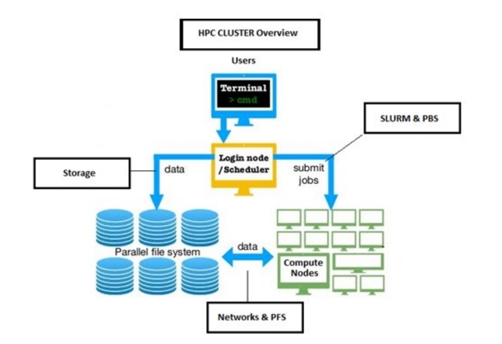
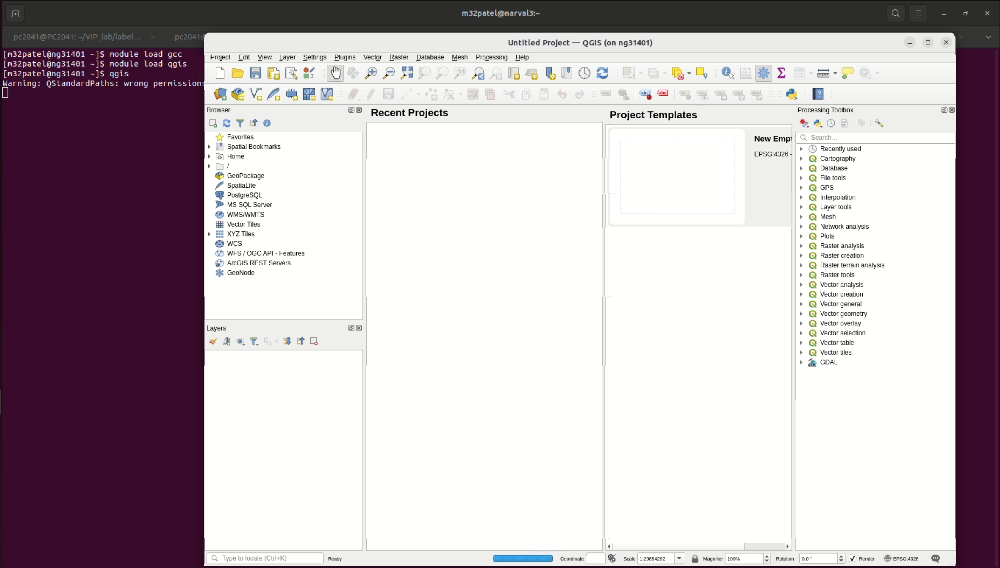

# A Guide to Using Canada's Digital Research Alliance (DRAC) for Research Computing

**Contributed by:** Muhammed Patel, MASc //
**Publication date:** 27 Aug 2025

This tutorial will guide you through using the Digital Research Alliance of Canada (DRAC), formerly Compute Canada, for your research computing needs. DRAC provides Canadian researchers with access to powerful advanced research computing (ARC) resources and services, including a wide array of GPUs and CPUs to support various workloads, from machine learning to large-scale simulations.

For comprehensive information, you can always refer to the [official DRAC documentation](https://docs.alliancecan.ca/wiki/Technical_documentation).

This guide covers the following topics:

0.  [What is High-Performance Computing (HPC)?](#what-is-high-performance-computing-hpc)
1.  [Setting up your DRAC account](#1-setting-up-your-drac-account)
2.  [Connecting to DRAC resources via SSH](#2-connecting-to-drac-resources-via-ssh)
3.  [Using SSH keys for passwordless login](#3-using-ssh-keys-for-passwordless-login)
4.  [Submitting jobs to a compute cluster](#4-submitting-jobs-to-a-compute-cluster)
5.  [Bonus: Using QGIS for remote geospatial analysis](#5-bonus-using-qgis-for-geospatial-analysis)

---

## What is High-Performance Computing (HPC)?



High-Performance Computing (HPC) refers to the use of supercomputers and parallel processing techniques for solving complex computational problems. Think of an HPC cluster as a powerful, remote computer equipped with a massive number of CPUs, GPUs, abundant RAM, and vast storage.

These systems typically run a Unix-based operating system (like Linux) and are accessed via a command-line interface, not a graphical user interface (GUI) like Windows or macOS.

An HPC cluster consists of two main types of computers:

*   **Login Nodes:** These are the gateways to the cluster. You connect to a login node to manage your files, compile code, and submit jobs. They have limited resources and should not be used for intensive computations.
*   **Compute Nodes:** These are the workhorses of the cluster, equipped with powerful processors and large amounts of memory. Your jobs run on these nodes to perform the actual computations.

---

## 1. Setting up Your DRAC Account

Access to DRAC resources is free for Canadian university faculty members. Students and research staff can also gain access under a faculty supervisor.

To get an account, you'll need your supervisor's CCRI number and can apply [here](https://alliancecan.ca/en/services/advanced-research-computing/account-management/apply-account).

After you submit the application, your supervisor will receive a notification to approve it. Once approved, you will receive an email with your login credentials. You will also need to set up Two-Factor Authentication (2FA) for your account. Follow the instructions in the email or read the guide [here](https://docs.alliancecan.ca/wiki/Multifactor_authentication).

---

## 2. Connecting to DRAC Resources via SSH

You can access DRAC resources from your local machine using SSH (Secure Shell). Most macOS and Linux systems have an SSH client pre-installed. For Windows, you can use a tool like [MobaXterm](https://mobaxterm.mobatek.net/) or the built-in OpenSSH client.

DRAC offers multiple national systems (clusters). In this tutorial, we will use `nibi.sharcnet.ca`. You can find information on other systems [here](https://docs.alliancecan.ca/wiki/Getting_started#What_systems_are_available?).

To connect, open a terminal (or your SSH client) and run:

```bash
ssh your_username@nibi.sharcnet.ca
```

Replace `your_username` with your DRAC username. You will be prompted for your password and your 2FA code.

---

## 3. Using SSH Keys for Passwordless Login

SSH keys provide a convenient and secure way to log in without entering your password every time. An SSH key pair consists of a private key (which you keep on your computer) and a public key (which you place on the server). So think like a lock and key: the public key is the lock that you keep on DRAC, while the private key is the key that opens the lock and must be kept secret. 


### Step 1: Generate an SSH Key Pair

If you don't already have an SSH key, generate one on your local machine:

```bash
ssh-keygen -t rsa -b 4096 -C "DRAC access key"
```

When prompted, you can press Enter to save the key to the default location (`~/.ssh/id_rsa`). You can also set an optional passphrase for extra security. But I'd recommend leaving it empty for convenience.

This will create two files:
*   `~/.ssh/id_rsa` (your private key - keep it secret!)
*   `~/.ssh/id_rsa.pub` (your public key)

### Step 2: Add Your Public Key to DRAC

You need to copy the contents of your id_rsa.pub to the DRAC servers.

*   **Recommended Method (Web Interface):**
    1.  Log in to the [CCDB website](https://ccdb.alliancecan.ca/).
    2.  Navigate to "My Account" -> "SSH Keys".
    3.  Copy the entire content of your `id_rsa.pub` file.
    4.  Paste the key into the text box and click "Add Key".
    This will automatically add your key to all DRAC clusters.

*   **Alternative Method (`ssh-copy-id`):**
    You can use the `ssh-copy-id` command to copy your key to a specific cluster:
    ```bash
    ssh-copy-id your_username@nibi.sharcnet.ca
    ```
    You will need to repeat this for each cluster you want to access. This is the old traditional way but will come handy in an advanced tutorial in the future.

### Step 3: Configure Your SSH Client

You can create an SSH config file to simplify your connection command. Create or edit the file `~/.ssh/config` and add the following:

```
Host nibi
    HostName nibi.sharcnet.ca
    User your_username
    IdentityFile ~/.ssh/id_rsa
```

Replace `your_username` with your DRAC username.

Note "~/" is a shorthand for your home directory. On Windows, it might be `C:\Users\YourUsername\.ssh\config`.

### Step 4: Test Your Connection

Now, you should be able to connect by simply typing:

```bash
ssh nibi
```

You should be logged in without a password prompt.

---

## Using VSCode for Remote Development

The [Remote - SSH extension](https://marketplace.visualstudio.com/items?itemName=ms-vscode-remote.remote-ssh) in Visual Studio Code allows you to work on files on a remote server as if they were on your local machine.

1.  Install the extension from the VSCode Marketplace.
2.  Open the "Remote Explorer" from the sidebar.
3.  Your SSH hosts from the `~/.ssh/config` file (like `nibi`) will be listed.
4.  Connect to a host. Once connected, you can open folders and files on the remote machine and edit them directly in VSCode.

---

## 4. Submitting Jobs to a Compute Cluster

There are two primary ways to run jobs on the cluster:

*   **Interactive Jobs:** These give you a live terminal on a compute node with the resources you request. They are great for development, debugging, and running GUI applications.
*   **Batch Jobs:** These run a script in the background. You submit a script with resource requests and commands, and the scheduler runs it when resources are available. This is ideal for long-running, non-interactive tasks.

### Interactive Job Example

To request an interactive session with 1 CPU and 4GB of memory for 1 hour, use the `salloc` command on a login node:

```bash
salloc --cpus-per-task=1 --mem=4G --time=1:00:00 --account=def-your_account
```
Replace `def-your_account` with your allocation account. This will give you a shell prompt on a compute node. If you don't know your allocation account, you can find it by running the `id` command in the terminal and look for something starting with `def-`

### Batch Job Example

To submit a batch job, create a submission script (e.g., `submit_job.sh`):

```bash
#!/bin/bash
#SBATCH --nodes=1                   # Number of nodes
#SBATCH --gpus-per-node=1           # Number of GPUs per node
#SBATCH --tasks-per-node=4          # Number of tasks (processes) to run
#SBATCH --cpus-per-task=4           this is number of CPU cores per task. For running multi-threaded applications(like QGIS), you may want to increase this 
#SBATCH --mem=100G                  # Memory allocation
#SBATCH --time=2:59:00              # Wall time limit
#SBATCH --output=output/%j.out      # Standard output and error log Job will be saved at output/<job_id>.out>. Remember to create the output directory if it doesn't exist
#SBATCH --account=def-myaccount     # Your allocation account
#SBATCH --mail-user=your_email@example.com
#SBATCH --mail-type=ALL             # Email notifications (BEGIN, END, FAIL, ALL)

# Load necessary software modules
module load python/3.8

# Run your commands
srun python my_script.py
srun python my_other_script.py # this will run after the my_script has finished executing
```

Remember to create the `output` directory before submitting. Submit the job using `sbatch`:

```bash
sbatch submit_job.sh
```

The scheduler will run your job when resources are available. You can read more about job scheduling policies [here](https://docs.alliancecan.ca/wiki/Job_scheduling_policies).

---

## 5. Bonus: Using QGIS for Geospatial Analysis

You can run graphical applications like QGIS on the cluster, which is useful for processing large geospatial datasets. This requires X11 forwarding to display the GUI on your local machine.

### Prerequisites: X11 Forwarding

*   **Windows:** Use a tool like [MobaXterm](https://mobaxterm.mobatek.net/), which has built-in X11 forwarding.
*   **macOS:** Install and run [XQuartz](https://www.xquartz.org/).
*   **Linux:** X11 server is typically installed by default.

Next, enable X11 forwarding in your `~/.ssh/config` file:

```
Host nibi
    HostName nibi.sharcnet.ca
    User your_username
    IdentityFile ~/.ssh/id_rsa
    ForwardX11 yes
    ForwardX11Trusted yes
```

### Running QGIS

1.  Connect to the cluster with X11 forwarding enabled: `ssh nibi`
2.  Request an interactive job with the `--x11` flag:
    ```bash
    salloc --cpus-per-task=4 --mem=16G --time=1:00:00 --x11 --account=def-your_account
    ```
3.  Once on the compute node, load the required modules:
    ```bash
    module load gcc
    module load qgis
    ```
4.  Start QGIS:
    ```bash
    qgis
    ```

The QGIS interface should appear on your screen (like below), running on the powerful compute node.



---

This guide provides a starting point for using DRAC resources. In future tutorials, we’ll dive into more advanced topics such as common DRAC commands, leveraging GPUs for machine learning, setting up SSH-agent, Github access on Compute canada and using the VSCode debugger on interactive nodes.

The support team of DRAC is very proactive and is also an excellent resource for more advanced topics and troubleshooting. Happy computing!
